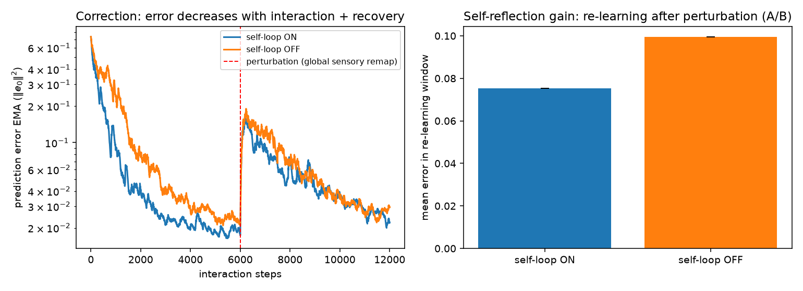
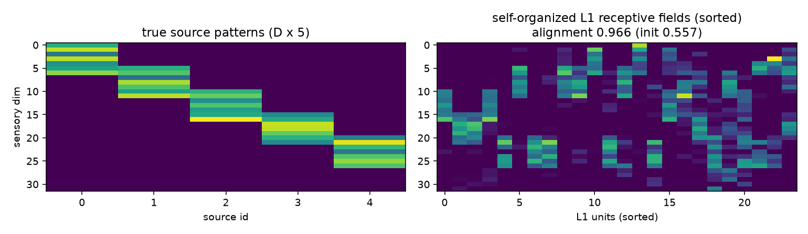
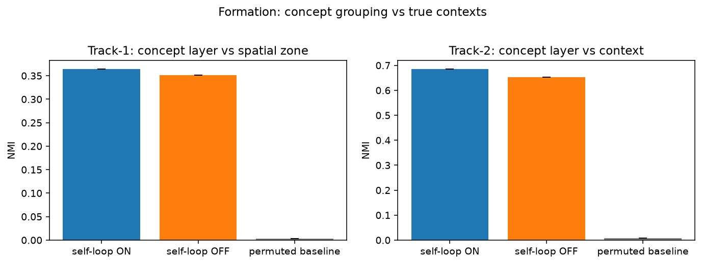
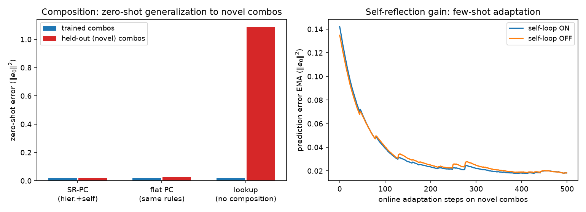
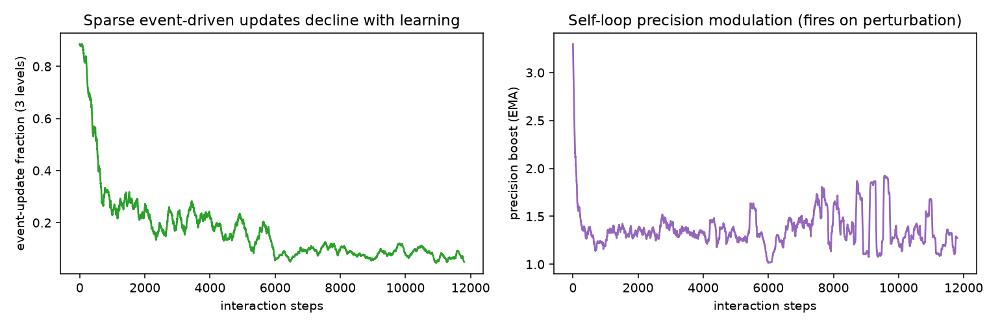

# SR-PC Phase-0 验收报告（自动生成）

总体结论：**FAIL** · 运行耗时 17s · 全程无反向传播、在线增量

对应 docs/SRPC_DESIGN.md 7.5 验收标准：

| 条件 | 结果 | 关键证据 |
|---|---|---|
| 1 自组织层级结构 | PASS | 感受野对齐 0.966（初始 0.557），捕获率 100%；概念层 NMI 0.364（随机 0.003）；组合流特征捕获率 100% |
| 2 误差随交互下降 | PASS | EMA 斜率 -3.62e-05；首/末十分位误差 0.3224 → 0.0189 |
| 3 自省环非零增益 | PASS | 扰动重学窗口误差 ON 0.0753 vs OFF 0.0994（低 24%）；恢复步数 ON 5061 vs OFF 4877；扰动后稳态误差 ON 0.0256 vs OFF 0.0271 |
| 4 无反传·在线 | PASS | 纯 NumPy 局部规则；逐样本在线更新 |
| 5 信用分配早筛（§8.5 承重墙） | FAIL | 延迟 Δ=4：误差驱动 0.526 vs 纯相关 0.508（机会 0.5，分离 0.018）；远端权重驱动 0.544（机会 0.20）；Δ=1 对照：误差驱动 0.474 vs 纯相关 0.478（两者皆可学）|

## 补充指标（7.4 组合 / 不变量 3 能量）

- 零样本组合泛化：SR-PC 保留组合误差 0.0200 vs 查表基线 1.0875（训练组合 0.0182 vs 0.0181）
- 片段重组：保留组合 x1 重组余弦 0.997（训练组合 0.997），工作空间重组余弦 0.951
- 新概念新颖性（x2 模式距离比）：0.69
- 少样本适应（保留组合）：ON 增益 0.0560 vs OFF 0.0539
- 事件驱动更新率：前期 0.429 → 末期 0.077

## 图表

