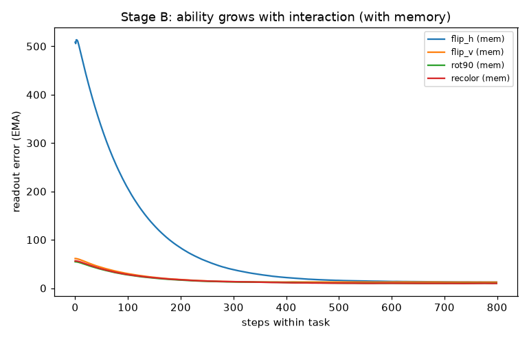
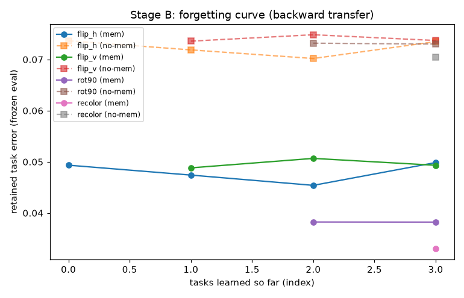
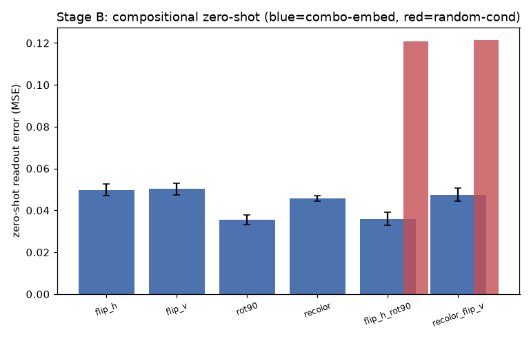
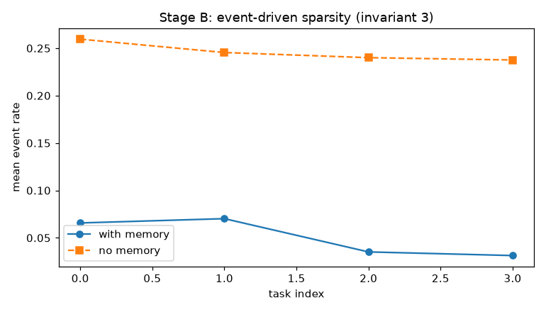

# SR-PC 阶段 B 验收报告（自动生成）

总体结论：**PASS** · 运行耗时 35s · 全程 NumPy 局部规则、免反向传播

对应 docs/SRPC_DESIGN.md 第 8 节里程碑 B：

| 里程碑 | 结果 | 关键证据 |
|---|---|---|
| 1 能力随交互上升 | PASS | 任务内误差斜率（跨 seed 均值）：['-3.71e-01', '-3.40e-02', '-3.35e-02', '-3.56e-02']，最差 -3.72e-01（全部 < 0） |
| 2 免遗忘（带记忆） | PASS | 末列相对回升均值 0.7%（max 5.3%） |
| 3 记忆增益 | PASS | 带记忆保留误差 4.3% vs 无记忆 7.3%（改善 41%） |
| 4 组合零样本 | PASS | 组合嵌入 0.0417 vs 随机条件 0.1211（增益 66%） |

## 补充指标

- 保留组合逐项零样本误差：{'flip_h_rot90': '0.0359', 'recolor_flip_v': '0.0475'}
- 训练变换冻结误差：{'rot90': '0.0355', 'recolor': '0.0456'}
- 事件驱动更新率（能量代理）：mem 0.051 vs no-mem 0.246

## Pareto 回归（4.3 单调性检查：阶段 A 指标不退化）

- Phase-0 7.5 快速回归（1 seed 冒烟）：**PASS**（A 指标未退化）

## 图表

