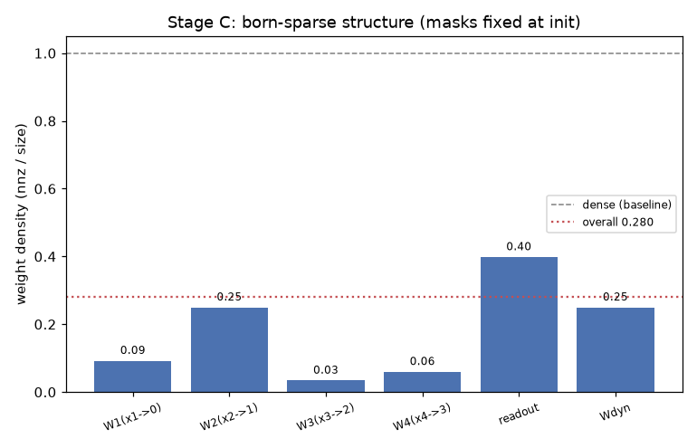
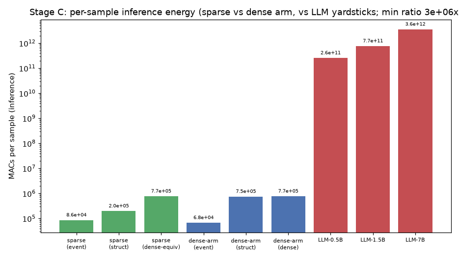
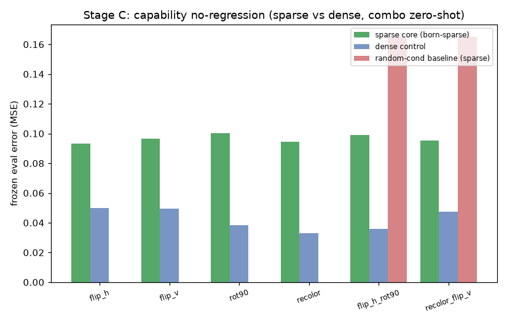
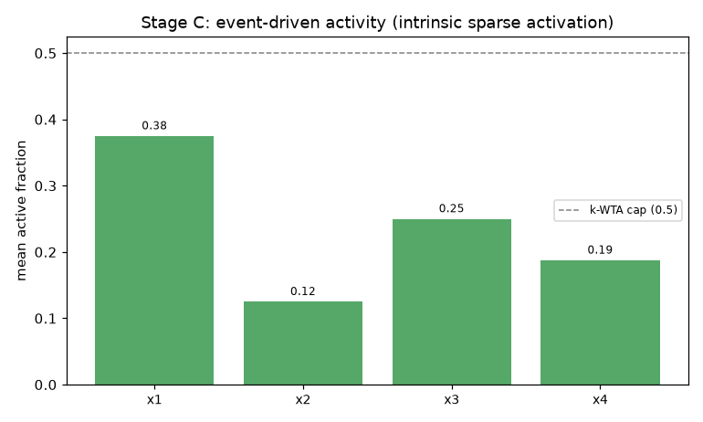

# SR-PC 阶段 C 验收报告（软件版内在化，自动生成）

总体结论：**PASS** · 运行耗时 52s · 全程 NumPy 局部规则、免反向传播

无专用硬件（CPU/GPU 软件验证）：验证**架构本身**的低功耗——出生即结构稀疏
（分块/扇入受限权重 + k-WTA）的核心从头重训，能力与能效双验收。
硬件部署本体（事件驱动/低比特/神经形态芯片）deferred 至有专用硬件。

| 里程碑 | 结果 | 关键证据 |
|---|---|---|
| C1 能力无回撤（阶段 B 复跑） | PASS | 稀疏核心上 B 四项：学习 PASS / 免遗忘 PASS / 记忆增益 PASS / 组合零样本 PASS（组合增益 41%） |
| C2 能效（vs 大模型标尺） | PASS | 每样本推理 8.63e+04 MACs（事件驱动）vs LLM-0.5B 2.56e+11 / LLM-1.5B 7.68e+11 / LLM-7B 3.58e+12（最低比率 3e+06x，>= 10^3） |
| C3 结构由构造保证 | PASS | 权重总密度 0.280（66575 / 237568 突触），掩码自出生不变 = True |
| C4 int8 部署就绪 | PASS | 量化后冻结误差 0.0986 vs fp 0.0982；组合 0.1027 vs fp 0.1001 |

## 能耗明细（硬件无关三口径）

| 口径 | 每样本推理 MACs | 说明 |
|---|---|---|
| 事件驱动 | 8.632e+04 | 活跃单元 × 已有突触（事件驱动硬件真实计算量） |
| 结构 | 1.987e+05 | 全单元 × 已有突触（结构稀疏硬件保守上界） |
| 稠密等价 | 7.729e+05 | 同规模稠密网络（稠密硬件真实计算量） |

**同口径对照（稀疏核心 vs 稠密对照臂，每样本推理 MACs）**：

| 口径 | 稀疏核心 | 稠密对照臂 | 节省 |
|---|---|---|---|
| 事件驱动 | 8.632e+04 | 6.784e+04 | -27% |
| 结构 | 1.987e+05 | 7.549e+05 | 74% |
| 稠密等价 | 7.729e+05 | 7.729e+05 | 0% |

口径解读（臂间对比的正确姿势）：

- **结构口径是架构内在能耗的主度量**（全单元 × 已有突触，不受运行时激活幅值分布影响）：稀疏核心节省 74%，由出生即定型掩码保证。
- 事件口径臂间不可直接比：稠密对照臂内部层事件活跃率近 0（静默层 ['x1', 'x2', 'x3']，激活幅值低于事件阈值、信息流微弱），而稀疏核心 k-WTA 保证内部层真实信息流（活跃率 {'x1': '0.38', 'x2': '0.12', 'x3': '0.25', 'x4': '0.19'}）——稀疏核心的事件 MACs 是"真实计算"的代价，稠密臂的低事件值是"内部静默"的结果。
- 事件口径的正确用法：与大模型标尺比（C2，3e+06x）及与自身稠密等价比（89% 节省）。

- 组合零样本（两次变换串联）：1.838e+05 MACs/样本（事件驱动）
- 全程训练总能耗（4 任务顺序学习）：稀疏 3.995e+08 vs 稠密对照 2.998e+08 MACs
  （注：训练段事件口径稀疏臂高于稠密臂，原因同上——k-WTA 结构性活跃下限 + 内部层真实传播误差，稠密臂内部层事件静默且误差幅值低；训练能耗是一次性成本，部署相关的稳态度量是冻结推理。**结构口径（架构属性）稀疏臂训练亦省 74%。**）
- 每层平均活跃率：{'x1': '0.38', 'x2': '0.12', 'x3': '0.25', 'x4': '0.19'}
- 事件驱动更新率：0.956

## 结构明细

| 组件 | 密度 | 突触数（nnz/size） |
|---|---|---|
| W1(x1->0) | 0.092 | 3787 / 40960（fan-in 64） |
| W2(x2->1) | 0.250 | 5120 / 20480（fan-in 40） |
| W3(x3->2) | 0.034 | 490 / 14336（fan-in 32） |
| W4(x4->3) | 0.060 | 858 / 14336（fan-in 28） |
| 读出头（×任务） | 0.398 | 52224 / 131072 |
| Wdyn（自省环） | 0.250 | 4096 / 16384 |

## 能力对照（稀疏核心 vs 稠密对照，同 seeds）

- 保留误差（末列）：稀疏 ['0.0934', '0.0964', '0.1002', '0.0946'] vs 稠密 ['0.0499', '0.0493', '0.0382', '0.0331']
- 组合零样本：稀疏 {'flip_h_rot90': '0.0991', 'recolor_flip_v': '0.0954'} vs 稠密 {'flip_h_rot90': '0.0359', 'recolor_flip_v': '0.0475'}

> 大模型标尺（6.1b）仅为比较基准，不进入系统构造（v1.4）。
> MACs 口径：每参数每 token 1 次 MAC；SR-PC 每样本一次映射任务。

## 图表

